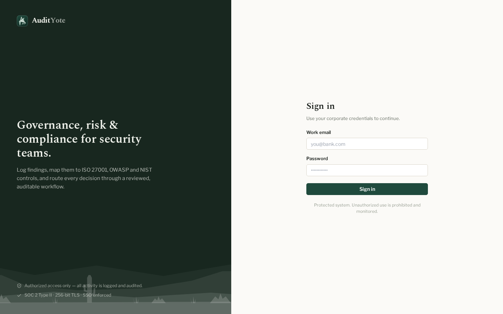
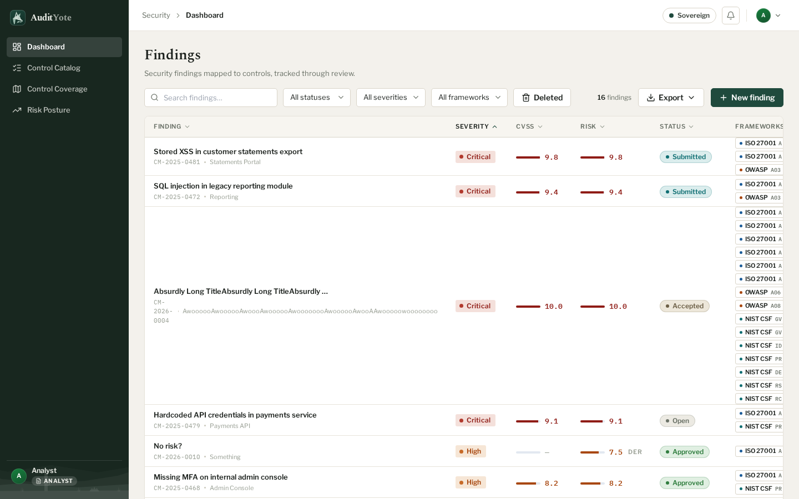
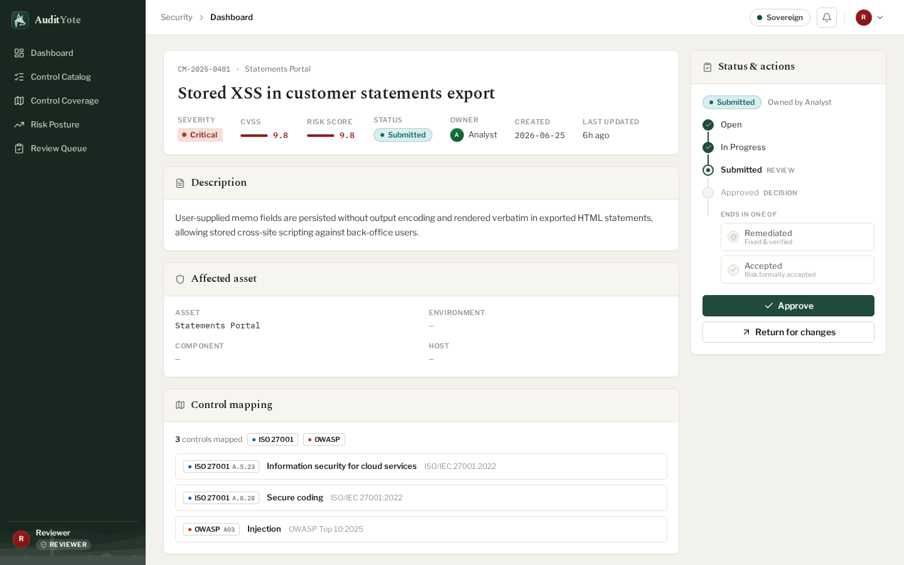
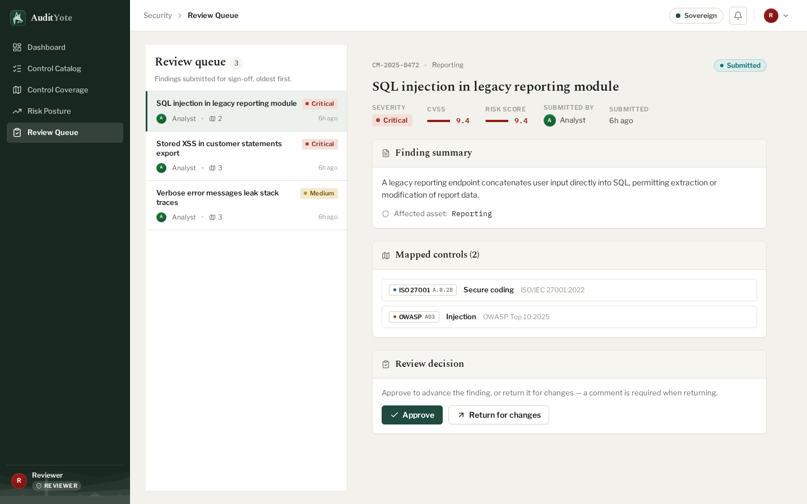
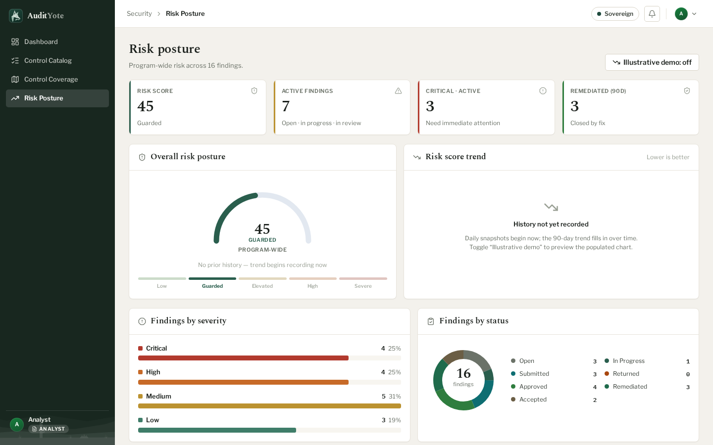
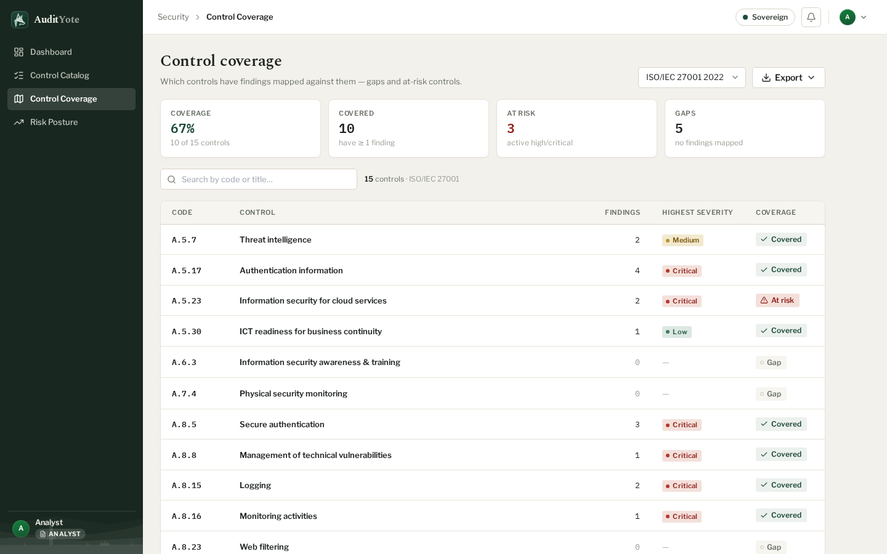
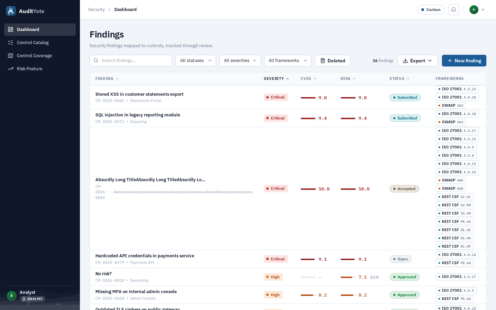

# AuditYote

A web app for recording security findings and mapping them to compliance controls. It gives a security team one place to log vulnerabilities, tie each one to the controls it affects across ISO/IEC 27001, the OWASP Top 10, and NIST CSF, move findings through a review and sign-off process, and produce the coverage and audit reports that governance work runs on.

Live demo: https://audityote.pasin.dev

<p align="center">
  
</p>

Most teams track this in a spreadsheet. AuditYote replaces the spreadsheet with a multi-user system that keeps an audit trail, enforces who is allowed to approve what, scores risk, and shows where controls have gaps. It was built solo as a four-week university capstone for a systems software construction course, and the whole application is deployed and running over HTTPS.

## What it does

AuditYote has three roles, and what you can do depends on yours.

Every signed-in user lands on a dashboard of findings with a filter bar (status, severity, framework, and free-text search) over a sortable table. They can browse the control catalog, check coverage per framework to see which controls are covered and which are gaps, read the risk posture, and export CSV or PDF reports. Account settings let them change their display name and password.

<p align="center">
  
  <br>
  <sub><em>The findings dashboard — severity, CVSS, a CVSS-based or severity-derived risk score, workflow status, and the controls each finding maps to, all behind a filter bar.</em></sub>
</p>

An analyst creates and edits findings. Each finding gets a readable reference like `CM-2026-0001`, and when it has a CVSS score its severity is set from the CVSS band automatically. The analyst maps a finding to one or more controls through a searchable picker, then drives it through the workflow: submit for review, resubmit after a return, mark remediated, or reopen. When a reviewer sends a finding back, the analyst sees it in a notifications dropdown and a dashboard chip, along with the reviewer's comment.

A reviewer works from a review queue ordered oldest first. They approve a finding or return it for changes, and a return has to carry a comment. A reviewer cannot approve their own findings, and that rule lives on the server, not in the interface. Approved findings can also be marked as accepted risk.

An admin manages users from a dedicated screen: change a role, deactivate or reactivate an account, or reset a password. Deactivated users are logged out on their next request. Admins cannot demote or deactivate themselves, and every admin action is written to a separate user-audit log.

## The review workflow

A finding moves through seven states, and the legal moves are defined by a state machine rather than scattered checks. Each state declares which transitions it allows, and a `WorkflowStateMachine` validates the action, the caller's role, and any guard before permitting it. An illegal transition returns 409 and a wrong-role attempt returns 403.

<p align="center">
  
  <br>
  <sub><em>A finding under review — its mapped controls on the left, and the reviewer's approve-or-return decision and lifecycle tracker on the right.</em></sub>
</p>

| From | Action | To | Who | Guard |
|---|---|---|---|---|
| Open or In progress | Submit | Submitted | Owner (analyst) | at least one mapped control |
| Open, In progress, or Returned | Edit | same (Open becomes In progress) | Owner | editing an open finding promotes it |
| Submitted | Approve | Approved | Reviewer, not the owner | |
| Submitted | Return for changes | Returned | Reviewer, not the owner | comment required |
| Returned | Resubmit | Submitted | Owner | |
| Approved | Mark remediated | Remediated | Owner | |
| Approved | Accept risk | Accepted | Reviewer | |
| Remediated or Accepted | Reopen | In progress | Owner | |

The rule that matters most is separation of duties. Only a reviewer can approve or return a submitted finding, and a reviewer can never act on a finding they own. That check is enforced in the backend, so removing a button from the UI is never what stops it.

<p align="center">
  
  <br>
  <sub><em>The reviewer's queue — findings awaiting sign-off, oldest first, with the approve-or-return panel alongside.</em></sub>
</p>

## Risk scoring and posture

Each finding gets a risk score from 0 to 10, chosen by a Strategy. If the finding has a CVSS base score, that value is used. Otherwise a fallback maps severity to a number (critical 9.0, high 7.5, medium 5.0, low 2.0). The response records which method produced the score, so a severity-derived score is shown as derived in the UI.

At the program level, a posture gauge runs from 0 to 100, where higher is worse. It weights the active findings (critical 10, high 6, medium 3, low 1), divides by a configurable cap, and clamps the result into one of five bands from Low to Severe. The posture view breaks findings down by severity and by status and shows a severity-by-status heatmap.

<p align="center">
  
  <br>
  <sub><em>Program risk posture — the 0–100 gauge and its band, the headline counts, and the severity and status breakdowns underneath.</em></sub>
</p>

## Control coverage and reporting

Coverage is computed per framework. For each control it shows how many findings map to it, the worst severity among them, and whether it is at risk, meaning it is still tied to an active high or critical finding. Summary tiles give the coverage percentage and the counts of covered, at-risk, and gap controls.

<p align="center">
  
  <br>
  <sub><em>Control coverage for a framework — what is covered, what is at risk, and where the gaps are, control by control.</em></sub>
</p>

Reports export as CSV or PDF for three views: the findings register, the coverage table, and the audit trail. The CSV output follows RFC 4180 with a UTF-8 byte-order mark and guards against spreadsheet formula injection. The PDF is A4 landscape with tinted headers and word-wrapped cells, generated with Apache PDFBox.

## Audit trail

Every change to a finding publishes a domain event: creation, an edit with a summary of what changed, mapping or unmapping a control, deletion, and each workflow transition. A listener writes an `AuditLog` row inside the same database transaction, so the record is atomic with the change it describes and is never touched afterward. The finding detail page renders this history as an activity timeline. Admin actions on accounts are recorded the same way in their own immutable log.

## Architecture

AuditYote is two separate applications. The frontend is a React single-page app built by Vite and served as static files by nginx. The backend is a standalone Spring Boot REST API. They talk over HTTP and JSON and are never merged into one process.

Every environment serves the API under the same origin as the SPA. The Vite dev proxy, the container's nginx, and the host's nginx in production all forward `/api` to the backend, so the browser never deals with CORS and the session cookie stays first-party.

```
Browser (React SPA, Vite build served by nginx)
        |  same-origin HTTPS
        v
nginx on the host (TLS via Let's Encrypt)   serves the SPA, proxies /api
        |
        v
Frontend container (nginx)  --/api-->  Backend container (Spring Boot)
                                              |  Spring Security (session + CSRF)
                                              |  JPA / Hibernate
                                              v
                                        PostgreSQL 16
```

Inside the backend, a request flows through a controller that speaks DTOs, into a service that holds the domain logic, down to a Spring Data JPA repository and PostgreSQL. A mapper layer keeps the JSON wire format separate from the JPA entities and translates between them, including the casing differences: the API uses lowercase severity and kebab-case status, while the enums are uppercase.

## Tech stack

| Area | Technology |
|---|---|
| Backend | Spring Boot 3.4.2, Java 21 (Temurin), Maven |
| Persistence | Spring Data JPA / Hibernate, PostgreSQL 16, Flyway (6 migrations) |
| Security | Spring Security, BCrypt, cookie-based CSRF |
| Reporting | Apache PDFBox 3.0.3 (PDF), RFC 4180 CSV |
| Frontend | React 19, Vite 8, TypeScript, Tailwind CSS 3.4, react-router 7, lucide-react |
| Tooling | oxlint, Playwright (reference screenshots) |
| Containers | Docker multi-stage builds, non-root images |
| Proxy and TLS | nginx + Certbot in production, Caddy with automatic TLS as an alternative |
| CI/CD | GitHub Actions with Semgrep (SAST) and Trivy (CVE, secret, and misconfiguration scanning) |

A few of these were deliberate. The frontend is a Vite SPA rather than Next.js, on purpose, so no frontend framework can quietly become a second backend; the backend is Spring Boot and only Spring Boot. Authentication uses stateful session cookies with CSRF protection rather than JWTs, which suits an app served from a single origin. The UI components are written from scratch against a token-based design system instead of pulled from a component kit.

## Data model

The schema has seven entities. A `User` has a role (analyst, reviewer, or admin), a BCrypt password hash, and an active flag. A `Framework` groups `Control` rows; the seed loads three frameworks and 37 controls. A `Finding` belongs to an owner, carries a severity and an optional CVSS score, holds an embedded `Asset` (name, environment, component, URL), and has a soft-delete timestamp. Findings connect to controls through a `FindingControlMapping` join that is unique per finding-and-control pair. Two tables hold history: `AuditLog` for every change to a finding and its transitions, and `UserAuditLog` for admin actions on accounts. Both are write-once.

Flyway owns the schema across six migrations, and Hibernate runs in validate mode, so a mismatch between the entities and the database is caught at startup instead of being papered over.

## Design patterns

A handful of patterns carry real weight in the code rather than sitting in comments. The workflow is a State machine. Risk scoring is a Strategy, selected by order. Report writers come from a Factory keyed on format, so adding a format is a new bean and no caller changes. Audit logging is an Observer: the service publishes an event and a listener records it, which keeps auditing out of the workflow code. Data access goes through Spring Data JPA repositories, and a DTO and mapper layer keeps the API contract independent of the persistence model. These line up with SOLID in practice: thin controllers, translation isolated in mappers, and behavior that extends by adding a class rather than editing an existing one.

## Design system

The interface runs on a set of CSS custom properties (colors, type scale, spacing, radius, and elevation) mapped into Tailwind, with two themes that switch live: a warm default called Sovereign and a cooler alternative called Carbon. All numbers, identifiers, CVSS scores, and control references use a monospaced font so they line up in tables. Severity and status colors are fixed by meaning and are never reused for anything else. There are no emoji; icons come from a single line-icon component. The layout is dense for desktop work and degrades on narrower screens.

<p align="center">
  
  <br>
  <sub><em>The same dashboard in the Carbon theme; the default is the warmer Sovereign. Both are the same components driven by different tokens.</em></sub>
</p>

## Security

Security is the point of the project, so it runs through the whole thing. Authentication uses Spring Security with session cookies (httpOnly, SameSite Lax, and Secure in production) and BCrypt password hashing that is never logged. Authorization is enforced on the server with method-level checks on the reviewer and admin endpoints, and the security filter chain requires authentication for everything except health, login, and registration.

CSRF protection uses a cookie-based token that the SPA echoes back in a header on unsafe requests. Logging out invalidates the server session, and an expired session sends the SPA to the login screen instead of failing silently. Offboarding takes effect right away: a per-request filter rechecks whether the account is still active, so a deactivated user is logged out on their next call and cannot sign back in.

Input is validated with Jakarta Bean Validation plus domain guards, and errors come back in one consistent shape with no stack traces or internal details. A failed login returns a generic message so accounts cannot be enumerated. All data access is parameterized through JPA, with no string-built SQL. No secrets live in the repository: `.env.example` is committed and the real `.env` is ignored.

The CI scanners are treated as gates. When Semgrep or Trivy flags something, it gets fixed rather than muted. For example, the PostgreSQL JDBC driver was pinned above its managed version to patch known CVEs, and the frontend was moved onto an unprivileged nginx image. Production traffic is HTTPS with a redirect from HTTP, and both audit logs are immutable.

## Running it locally

Docker and Docker Compose are the only things you need installed. Java, Node, and Postgres all run inside the build.

```bash
# 1. Configure the environment
cp .env.example .env
# edit .env: database credentials, the session secret, and the seed demo users

# 2. Start Postgres, the backend, and the frontend
docker compose --profile app up --build
```

The frontend is served at http://localhost:5173, the API at http://localhost:8080, and Postgres listens on 5432. The demo analyst, reviewer, and admin accounts come from the seed values you set in `.env`. `.env.example` documents every configuration key, including the datasource, the session secret, the seed users, the registration email-domain allowlist, and the posture cap.

## Continuous integration and deployment

Every push runs a GitHub Actions pipeline. A detect job gates the rest so the build stays quick in a monorepo. The backend job builds and runs the full test suite against a PostgreSQL service on Java 21. The frontend job installs dependencies, lints with oxlint, and builds with Vite. Two security scanners run and can fail the build: Semgrep with the default, OWASP Top Ten, and secrets rulesets, and Trivy across dependencies, secrets, and misconfiguration at high and critical severity.

Both images are multi-stage and run as a non-root user. The stack runs in Docker on a DigitalOcean droplet behind the host's nginx, with TLS from Let's Encrypt and an HTTP to HTTPS redirect. Flyway applies its migrations on startup, so the schema is created and versioned without manual steps. The reverse-proxy configuration and a deployment runbook live in the `deploy/` directory.

## Testing

The backend has 20 test classes and 116 test methods (JUnit 5, Mockito, and MockMvc, running against a real PostgreSQL in CI). They cover authentication and registration, finding CRUD and its edit constraints, control mapping and uniqueness, the full workflow state machine including role gating and separation of duties, audit-trail generation and immutability, coverage rollup, risk scoring, posture normalization, review-queue ordering, admin user management and its self-lockout guards, notifications, report export for CSV and PDF, soft-delete behavior, health, and seed idempotency. The frontend build is linted and type-checked in CI, and Playwright captures reference screenshots of the main screens.

## Project layout

```
backend/                     Spring Boot 3.4.2, Java 21, Maven
  src/main/java/io/muzoo/ssc/controlmap/
    audit/ config/ domain/ health/ report/ repository/
    risk/ security/ seed/ web/ workflow/
  src/main/resources/        application.yml, db/migration (V1-V6), catalog + seed data
  src/test/java/...          20 test classes
  Dockerfile
frontend/                    React 19 + Vite 8 + TypeScript
  src/  auth/ components/ design/tokens lib/ pages/
  Dockerfile  nginx.conf  tailwind.config.js  vite.config.ts
deploy/                      nginx vhost + deployment runbook
.github/workflows/ci.yml
docker-compose.yml  docker-compose.prod.yml  docker-compose.deploy.yml  Caddyfile
.env.example
```

For reference, the codebase is roughly 10,300 lines of production code across the two tiers: about 101 backend Java files and 20 test classes, and about 50 frontend TypeScript and TSX files. It has 7 entities, 11 REST controllers with 27 endpoints, 6 database migrations, 3 seeded frameworks with 37 controls, and about 24 React components across 13 screens, built over 46 commits.

## About this project

AuditYote was built solo as a university capstone for a systems software construction course. The codebase carries an earlier working name, ControlMap, in its Java package names (`io.muzoo.ssc.controlmap`), its configuration keys, and the `CM-` prefix on finding references; AuditYote is the product name.
